# Detection Flow — Diagram Set

*Updated flow charts for the closed-loop compliance pipeline. One master flow, then zoom-ins per stage and per detector family.*

**Date:** 2026-07-22
**Source of truth:** [Detection Layer Design](superpowers/specs/2026-07-22-detection-layer-design.md) · [Platform Design](superpowers/specs/2026-07-20-compliance-platform-design.md) · [Pipeline Plan](Compliance_Monitoring_Pipeline_Plan.md)

These replace the original hand-drawn daily-flow diagram. Section 10 lists exactly what changed and why.

---

## 1. Master flow

The whole system on one page. Automated stages run 00:00–09:00; humans work 09:00–17:00; the loops run on a slower cadence.

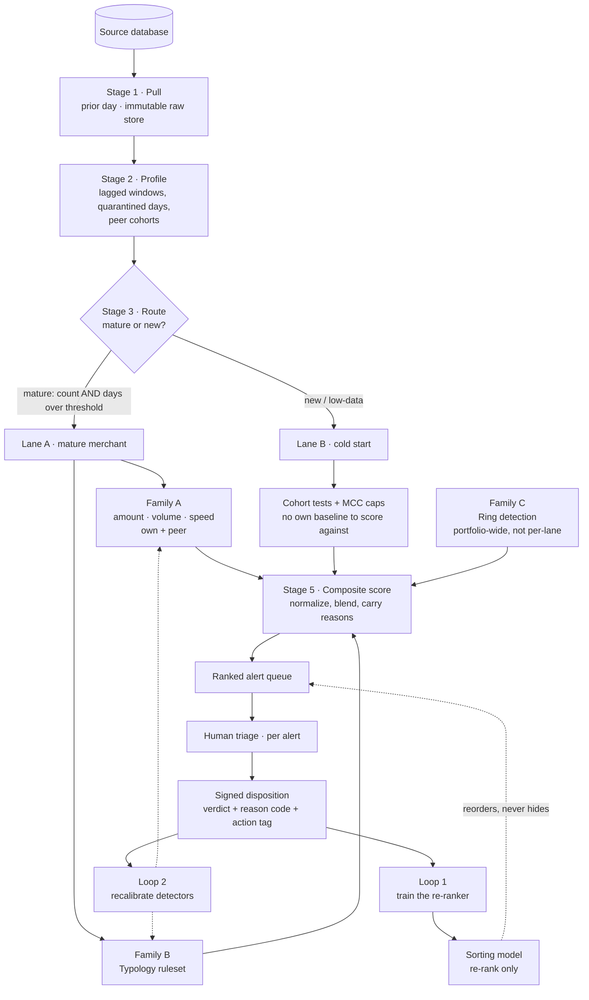

**Read it as:** one fork (mature vs new), three detector families feeding one score, one human decision, two feedback loops back into the machine.

---

## 2. Zoom · Stage 3 routing (the fork)

Why the fork exists: a merchant with two weeks of data has no meaningful "normal," so scoring it against its own baseline produces confident nonsense.

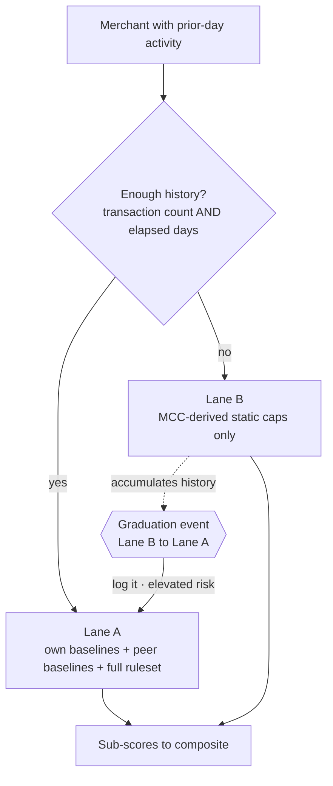

> **Graduation is an attack surface.** A bust-out operator builds "normal" history precisely in order to cross into Lane A, then spikes. Log every crossover and do not soften thresholds the moment a merchant graduates.

> **Lane B uses peer-derived *rules*, not a peer *model*.** Applying MCC-calibrated caps is fair; scoring a legitimately-unusual new merchant against a peer anomaly model over-flags it.

---

## 3. Zoom · Family A — robust baselines

Answers: *"is this number unusual for this merchant, or for its peers?"* Six detectors across three measured quantities and two frames of reference. Every one is natively explainable — each emits a `feature_snapshot` row the divergence panel renders, and all report the same modified z-score so they are comparable.

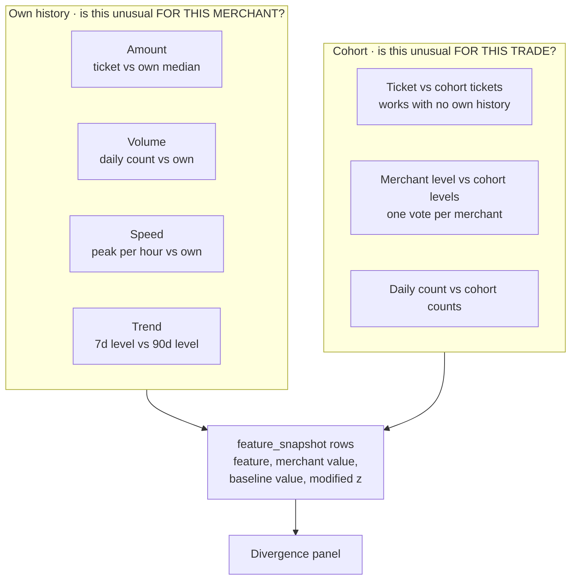

### 3a. Three measured quantities, and why all three

Amount alone leaves cohort manipulation free: to drag a cohort's amount distribution you must transact far more than your peers, so without a volume detector that evasion costs nothing.

| Quantity | Catches | Missed by the others |
|---|---|---|
| **Amount** | one large sale; wrong price level for the trade | — |
| **Volume** | many ordinary tickets; the manipulation attempt itself | amount sees nothing — every ticket is normal |
| **Speed** | a burst inside an ordinary daily total | volume sees nothing — the day's total is normal |

Each evasion route trips a different detector, and the lag means none of them can affect the baseline currently doing the judging.

### 3b. Why robust statistics, not mean and standard deviation

Transaction amounts are heavily right-skewed. A few legitimate large sales inflate the mean and balloon the standard deviation, so a classic z-score baseline drifts and **under-flags**. The median cannot be moved by a handful of outliers.

```
MAD = median( |xᵢ − x̃| )

modified z:   Mᵢ = 0.6745 · (xᵢ − x̃) / MAD
```

### 3c. The amount detector, including the guards

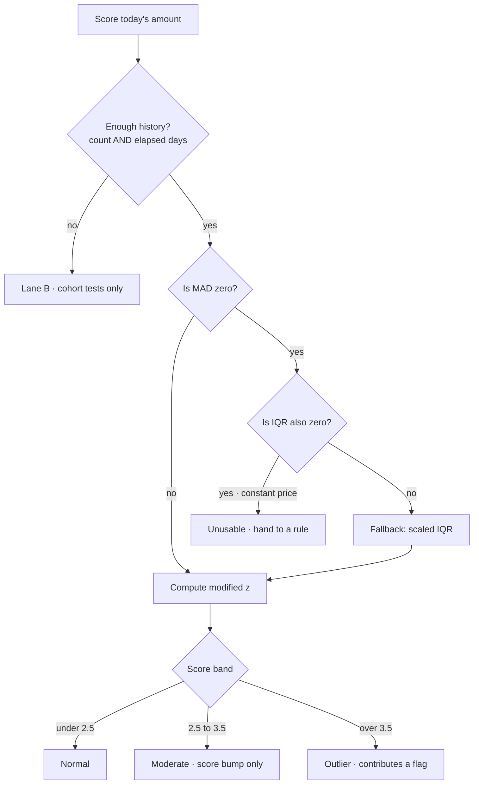

> **MAD = 0 is a real trap.** A merchant selling one product at one price has zero dispersion, so the modified z divides by zero and *every* transaction reads as infinitely anomalous. Never divide by a zero MAD.

> **Counts need a floor of one transaction.** A merchant trading exactly five times a day has zero spread in its *counts* — ordinary, not degenerate. Without a floor it falls to the constant fallback and a jump from five to sixty is invisible. Amounts keep the strict fallback, where zero spread genuinely does mean "fixed price".

> **Time is circular.** 23:30 and 00:30 are an hour apart, not 23. A linear time baseline is wrong at midnight.

### 3d. Baseline integrity — four defences

A self-fitted baseline can learn the crime. The median tolerates contamination up to 50% of the window; past that, and against slow ramps, it needs help.

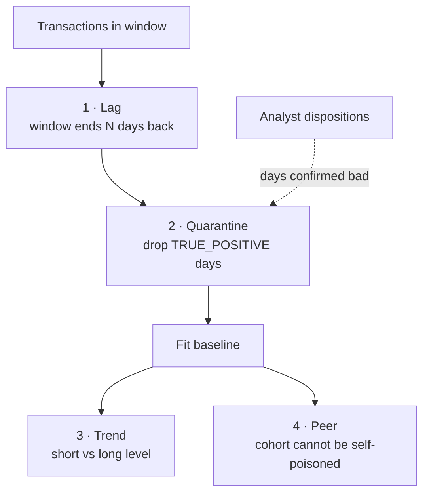

- **Lag** — the window is held back from the present. Not a tuning knob: a disposition takes days to arrive, so this is the interval in which analysts can still rule on activity *before* it becomes part of normal.
- **Quarantine** — days confirmed `TRUE_POSITIVE` never shape a future baseline, so the system stops absorbing its own confirmed findings. Cleared days stay in; cleared means legitimate.
- **Trend** — a short-window level against a long one. The only detector that sees a slow ramp, which is invisible to any trailing self-baseline by construction.
- **Peer** — a merchant can poison its own baseline but not its cohort's. The structural defence, and the reason a launch can lean on cohort comparison before any history is vetted.

### 3e. Peer cohort fallback

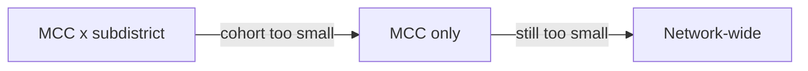

## 4. Zoom · Family B — typology ruleset

Answers: *"does this match a known laundering pattern?"* These are **not** statistical deviations — each transaction can look unremarkable on its own. This is why the ruleset carries more weight than its box size suggests.

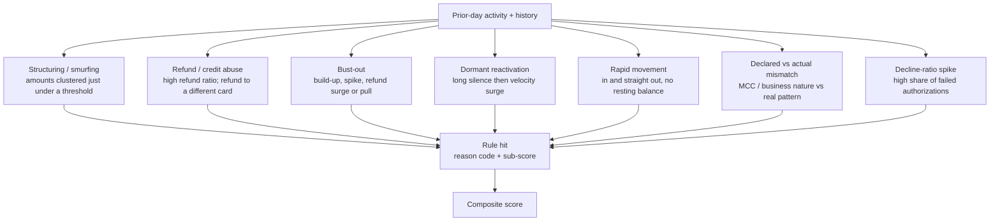

R6 is the *transaction-laundering* signature — a registered business fronting a different, hidden one. R7 is the in-scope, merchant-side read of card testing (we measure the merchant's decline rate; we do not chase stolen cards).

---

## 5. Zoom · Family C — ring detection

Answers: *"are these merchants coordinating?"* Two sub-layers with very different cost.

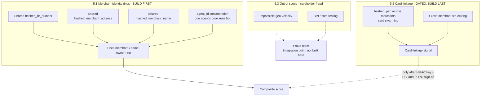

**Why merchant-identity rings come first:**

| | Merchant-identity (5.1) | Card-linkage (5.2) |
|---|---|---|
| Detects | shell merchants, same beneficial owner | cards swarming across merchants |
| Method | **equality join** — never un-hashed | equality join on cardholder identity |
| Reversibility issue | **irrelevant** — we never reverse | hash is brute-forceable, must protect |
| Privacy cost | low — links merchants to each other | high — maps where each cardholder shops |
| In scope | yes, directly | yes, but gated |

> The hashed PAN is 1:1 and therefore unsalted, and an unsalted PAN hash is reversible (fix the BIN and Luhn digit → ~10⁹ candidates). Treat it as sensitive data, prefer a keyed HMAC, keep it out of the analyst UI. See open questions Q2.

---

## 6. Zoom · Stage 5 composite scoring

How three families become one ranked queue *without* losing the reasons.

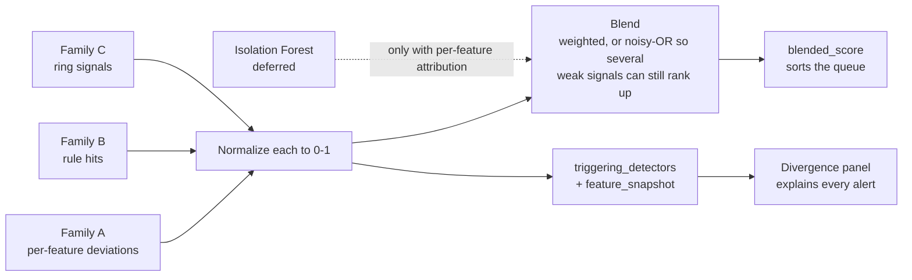

> **The score sorts; the reasons explain.** A single opaque number with no decomposition fails both the analyst and the regulator. Isolation Forest stays a deferred secondary signal precisely because its raw output has no per-feature reason.

---

## 7. Zoom · human triage and further check

The 09:00–17:00 loop. Expands the "Further Check" branch of the original diagram.

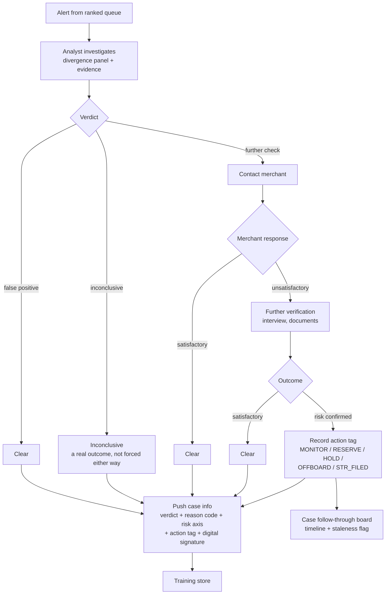

> **Actions are recorded, never executed here.** The portal is the system of record; reserves, holds, offboarding and STR filing happen in the real payment and filing systems.

> **Tipping-off guardrail.** Where an STR is involved, the platform must generate no merchant-facing message. An automated "your account is under review" email is a compliance incident.

> **Every disposition is signed.** Non-repudiation is the accountability backbone in a system whose actions occur elsewhere.

---

## 8. Zoom · the two feedback loops

The original diagram drew one loop. There are two, and they do different jobs.

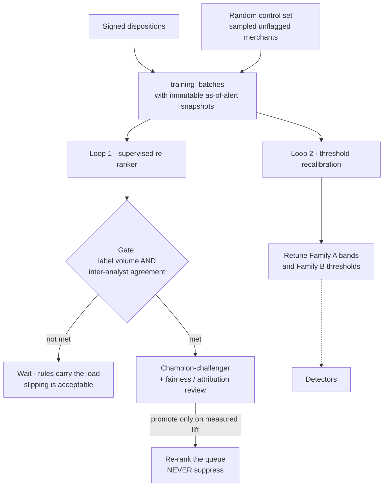

- **Loop 1** trains the sorting model — it reorders by likelihood of being a genuine further-check case so those are worked first. It never hides an alert.
- **Loop 2** is the arrow the original diagram was missing: dispositions should also retune the detectors themselves. A merchant repeatedly cleared as "seasonal" should have its own baseline widened.
- **The control set** exists because we only ever learn outcomes for alerts we raised. Without deliberately sampling *unflagged* merchants, both loops go confidently blind exactly where the detectors already miss.

---

## 9. Data → detector map

Which source columns feed which detector.

| Detector | Columns |
|---|---|
| Amount baseline (own + MCC/subdistrict peer) | `total_amount`, `net_amount`, `mcc`, `merchant_subdistrict` |
| Time baseline | `hkt_transaction_time` |
| Card-origin baseline | `card_issuing_country`, `card_origin`, `card_issuing_bank` |
| Peer cohorts | `mcc`, `merchant_subdistrict`, `merchant_district`, `merchant_area`, `city` |
| Structuring | `total_amount`, `hkt_transaction_time` |
| Refund abuse | `transaction_status` / `net_amount` sign *(encoding to confirm — Q1)*, `hashed_pan` |
| Declared vs actual mismatch | `mcc`, `business_nature`, `ownership_or_business_type`, `business_plan` |
| Decline-ratio spike | `transaction_status` |
| Merchant-identity rings | `hashed_br_number`, `hashed_merchant_address`, `hashed_merchant_name`, `agent_id` |
| Card-linkage rings *(gated)* | `hashed_pan` |
| Merchant state | `merchant_status`, `merchant_id` |

Not used for detection: `masked_pan` (display only — never an identifier), `payment_gateway`, `currency` (until multi-currency rules exist).

---

## 10. What changed from the original diagram

| Change | Why |
|---|---|
| Baselines split into **three named families** | The original "+ Ruleset" box was doing hidden heavy lifting. Baselines catch unusual *numbers*; rules catch *patterns* that look individually normal. Different jobs, different failure modes. |
| Added **Family C ring detection** as a portfolio-wide layer | Runs across merchants, not inside a merchant's lane — the per-merchant flow structurally cannot see coordination. |
| Ring detection leads with **merchant-identity**, not card | `hashed_br_number` / address / name give in-scope ring detection by equality join, with none of the cardholder-linkage privacy cost. Card layer demoted to last and gated. |
| Added **`agent_id`** as a risk dimension | One agent whose whole book runs hot is a gatekeeper-of-the-gatekeeper signal no per-merchant view can see. |
| Added the **second feedback loop** | The original drew labels → re-ranker only. Labels should also recalibrate detector thresholds. |
| Made the sorting model explicitly **re-rank only** | Confirmed decision. It reorders; it never hides an alert from a human. |
| Added **guards** (MAD = 0, min-history, circular time, cohort fallback) | Each is a silent failure that would either flood the queue or corrupt a baseline. |
| Added **inconclusive** as a first-class verdict | Forcing every case into true/false positive corrupts the training labels. |
| Marked **cardholder-fraud checks out of scope** | Impossible geo-velocity and BIN testing detect stolen *cards*, not bad *merchants* — different objective, different owner. |
| Dropped `terminal_id` | Not in the real schema. Cross-terminal checks are really cross-*merchant* or cross-*agent*. |
| Family A grew from one quantity to **three** | Amount alone left cohort manipulation free: dragging a cohort requires volume, and nothing was watching volume. Speed then covers the burst that an ordinary daily total hides. |
| Peer became **two** detectors | A median does not move for one large ticket, so a merchant-level cohort test cannot see a single outrageous transaction — the exact case a cold-start merchant presents, where no self baseline exists either. |
| Peer scoring switched from Tukey IQR to **median/MAD** | IQR breaks down at 25%, so in a small cohort one deviant member lands inside the upper quartile and drags Q₃ up far enough to hide itself. |
| Added the **four integrity defences** | A self-fitted baseline can learn the crime: lag, quarantine, trend and peer each close a different route. |
| Added the **baseline provenance page** | What each baseline is built from, and which day joins it tonight, was invisible. |
