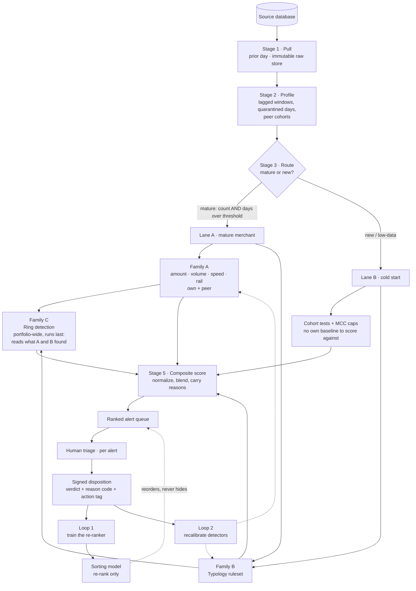
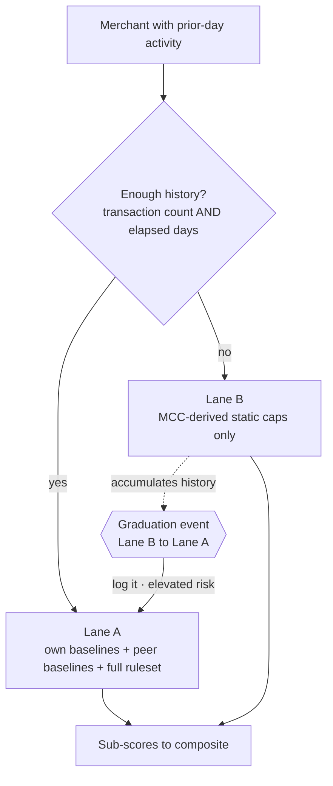
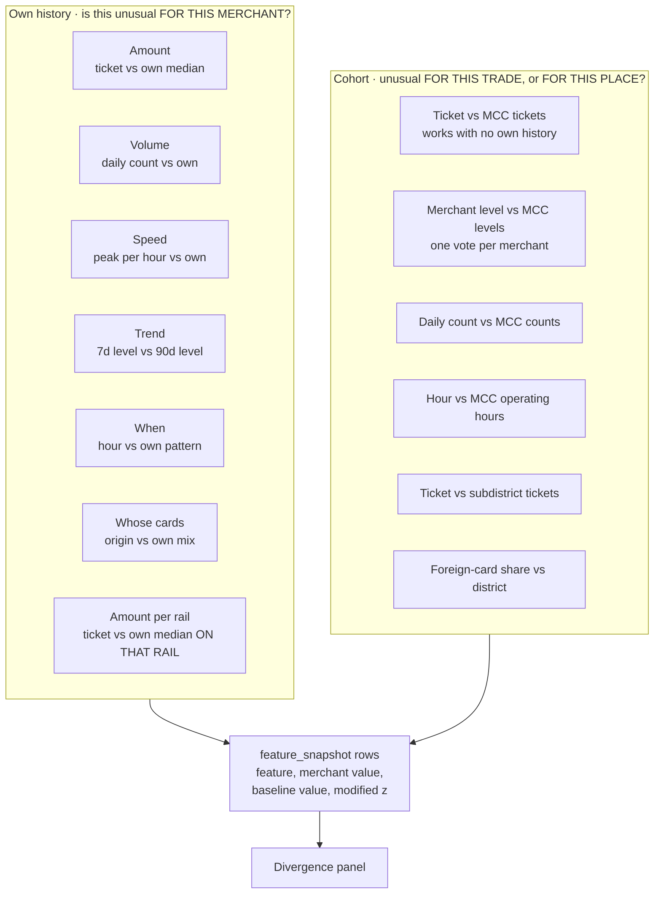
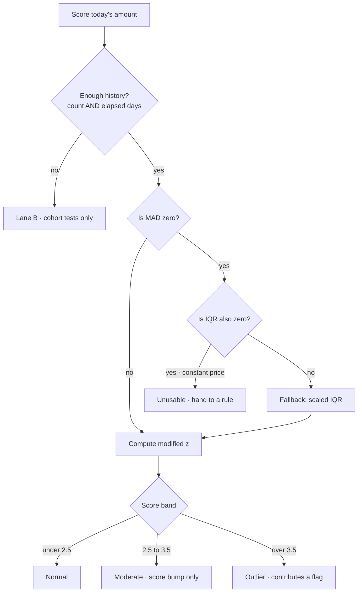
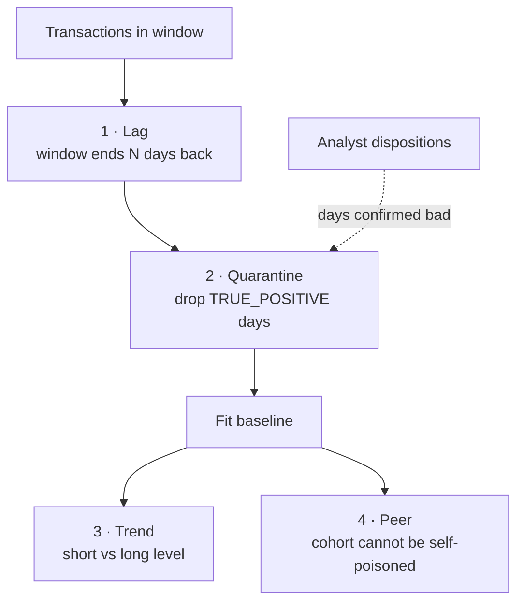
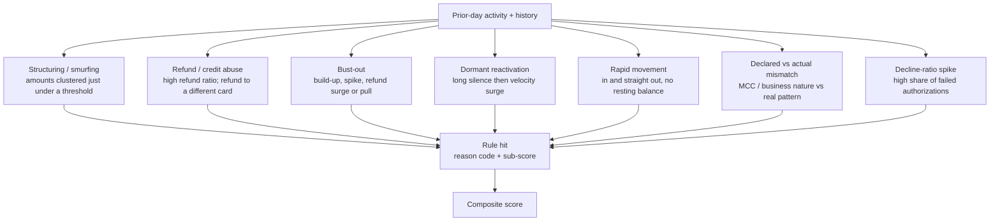
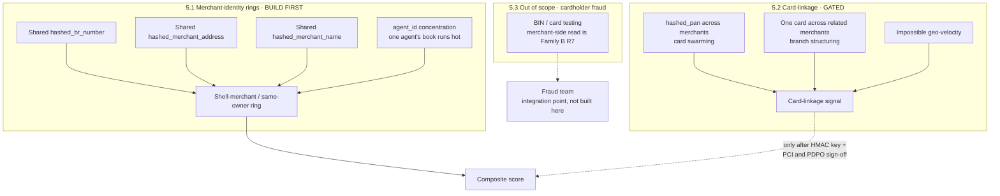
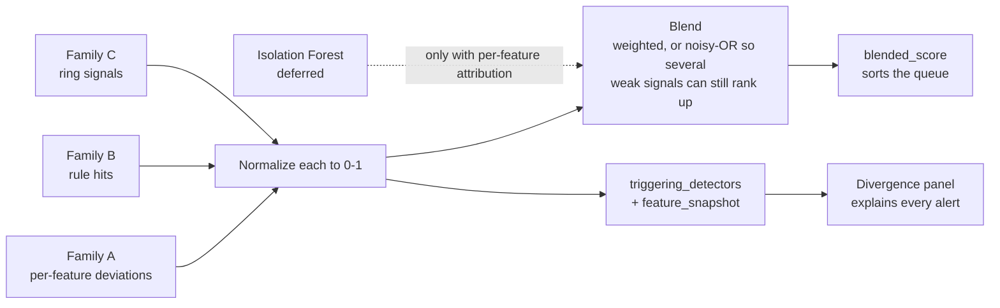
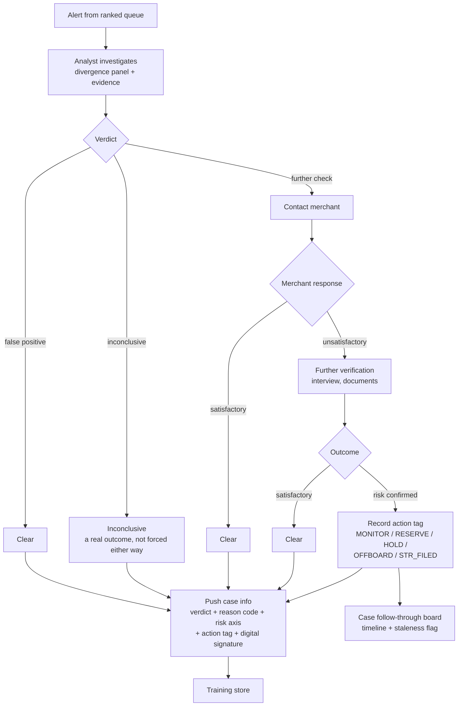
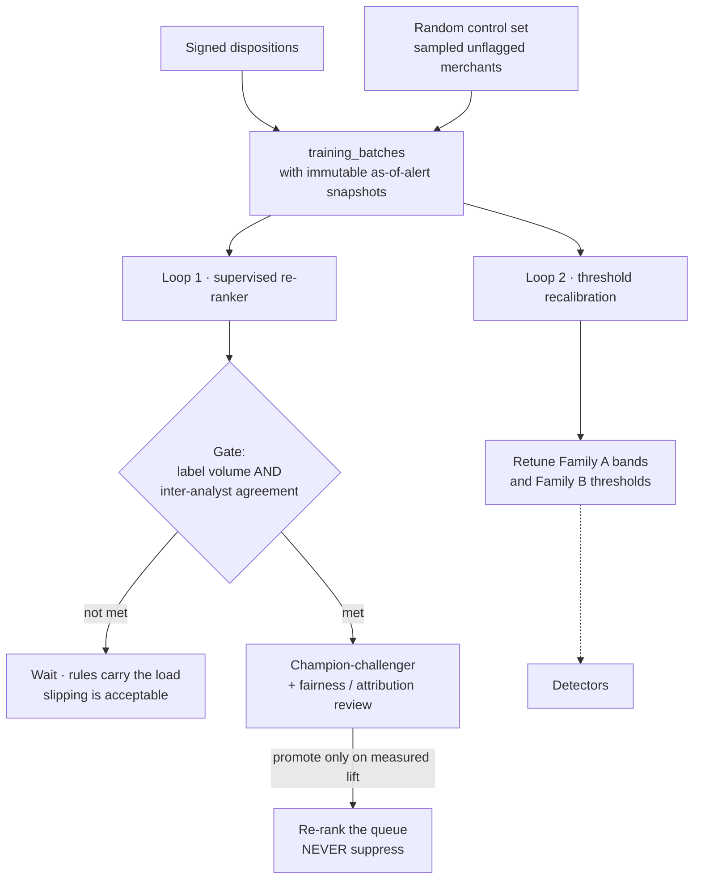

# Detection Flow — Diagram Set

*Updated flow charts for the closed-loop compliance pipeline. One master flow, then zoom-ins per stage and per detector family.*

**Date:** 2026-07-22
**Source of truth:** [Detection Layer Design](superpowers/specs/2026-07-22-detection-layer-design.md) · [Platform Design](superpowers/specs/2026-07-20-compliance-platform-design.md) · [Pipeline Plan](Compliance_Monitoring_Pipeline_Plan.md)

These replace the original hand-drawn daily-flow diagram. Section 10 lists exactly what changed and why.

---

## 1. Master flow

The whole system on one page. Automated stages run 00:00–09:00; humans work 09:00–17:00; the loops run on a slower cadence.



**Read it as:** one fork (mature vs new), three detector families feeding one score, one human decision, two feedback loops back into the machine.

Two things the fork does *not* gate. **Family B runs in both lanes** — a rule needs no fitted history, which is exactly why the cold-start merchants Family A cannot score are the ones the typology ruleset exists to cover. **Family C runs across the portfolio and last**, because a ring's severity depends on how many of its members the other two families just flagged.

---

## 2. Zoom · Stage 3 routing (the fork)

Why the fork exists: a merchant with two weeks of data has no meaningful "normal," so scoring it against its own baseline produces confident nonsense.



> **Graduation is an attack surface.** A bust-out operator builds "normal" history precisely in order to cross into Lane A, then spikes. Log every crossover and do not soften thresholds the moment a merchant graduates.

> **Lane B uses peer-derived *rules*, not a peer *model*.** Applying MCC-calibrated caps is fair; scoring a legitimately-unusual new merchant against a peer anomaly model over-flags it.

---

## 3. Zoom · Family A — robust baselines

Answers: *"is this unusual for this merchant, for its trade, or for where it trades?"* Thirteen detectors across three frames of reference — the merchant's own history, its MCC cohort, and its district. Every one is natively explainable: each emits a `feature_snapshot` row the divergence panel renders, all report the same modified z-score so they are comparable, and each **names the transactions it fired on** and the column of each that carries the cause (§3f).



### 3f. Payment-method baselines — why the rail is its own frame

A merchant's amount baseline pooled across every payment rail has a spread wide enough to swallow the rail that most needed watching. Octopus is a stored-value card for transit and small retail, so HKD 3,000 on it is remarkable; the same amount on Visa is unremarkable. Pooled, the Visa tail sets the dispersion and the Octopus outlier sits comfortably inside it.

So each merchant is fitted **once per `card_type`**, using the same median/MAD machinery, and a rail the merchant barely uses comes back unusable rather than fitted — a merchant taking Alipay twice a month has no Alipay pattern to be judged against.

### 3g. Materiality — statistical significance is not practical significance

A HKD 150 transaction can be a genuine four-sigma outlier at a convenience store and be worthless to a launderer. Firing on the z-score alone buried the actionable alerts under thousands of those, so an amount comparison must clear **both** the outlier threshold *and* an absolute floor (`materiality_floor`, default HKD 1,000).

The floor applies to amount comparisons only. A burst of small transactions or trading at 3am is not made harmless by being small — small and frequent is the shape of structuring.

### 3h. Every threshold is tunable without a deploy

`outlier_z`, `moderate_z`, `materiality_floor`, the maturity thresholds, the window and the lag all live in the database, with optional per-MCC overrides — a jeweller's tickets are lumpy where a grocer's are not, and one global threshold either floods the volatile trades or goes blind on the steady ones. Changes apply to the **next run**, never retroactively: existing alerts were judged under the thresholds in force at the time, and rewriting that would break the audit trail.

### 3i. Naming the evidence

A deviation with no way back to the rows that caused it leaves the analyst scanning the ledger by hand. Every detector therefore records, alongside its score, the transactions that drove it and the **source column** of each that carries the cause:

| Detector | Transactions named | Field highlighted |
|---|---|---|
| Amount (own / rail / MCC / subdistrict) | those breaching the threshold | `total_amount` |
| Volume (own / MCC) | the whole day — every transaction is the evidence | `occurred_at` |
| Speed | only those inside the busiest hour | `occurred_at` |
| Hour (own / MCC) | those at an unusual time | `occurred_at` |
| Card origin | those on a surprising issuing country | `card_issuing_country` |
| Foreign-card share | the overseas-issued ones | `card_issuing_country` |
| Merchant level vs MCC, trend | **none** — the merchant, not any transaction, is the subject | — |

Silence is meaningful: an empty set says "no transaction is the reason", which is different from "we did not look". The evidence is **frozen onto the alert** rather than recomputed on read, for the same reason `feature_snapshot` is — a later run with retuned thresholds would otherwise rewrite what the analyst was shown.

### 3a. Three measured quantities, and why all three

Amount alone leaves cohort manipulation free: to drag a cohort's amount distribution you must transact far more than your peers, so without a volume detector that evasion costs nothing.

| Quantity | Catches | Missed by the others |
|---|---|---|
| **Amount** | one large sale; wrong price level for the trade | — |
| **Volume** | many ordinary tickets; the manipulation attempt itself | amount sees nothing — every ticket is normal |
| **Speed** | a burst inside an ordinary daily total | volume sees nothing — the day's total is normal |

Each evasion route trips a different detector, and the lag means none of them can affect the baseline currently doing the judging.

### 3b. Why robust statistics, not mean and standard deviation

Transaction amounts are heavily right-skewed. A few legitimate large sales inflate the mean and balloon the standard deviation, so a classic z-score baseline drifts and **under-flags**. The median cannot be moved by a handful of outliers.

```
MAD = median( |xᵢ − x̃| )

modified z:   Mᵢ = 0.6745 · (xᵢ − x̃) / MAD
```

### 3c. The amount detector, including the guards



> **MAD = 0 is a real trap.** A merchant selling one product at one price has zero dispersion, so the modified z divides by zero and *every* transaction reads as infinitely anomalous. Never divide by a zero MAD.

> **Counts need a floor of one transaction.** A merchant trading exactly five times a day has zero spread in its *counts* — ordinary, not degenerate. Without a floor it falls to the constant fallback and a jump from five to sixty is invisible. Amounts keep the strict fallback, where zero spread genuinely does mean "fixed price".

> **Time is circular.** 23:30 and 00:30 are an hour apart, not 23. A linear time baseline is wrong at midnight.

### 3d. Baseline integrity — four defences

A self-fitted baseline can learn the crime. The median tolerates contamination up to 50% of the window; past that, and against slow ramps, it needs help.



- **Lag** — the window is held back from the present. Not a tuning knob: a disposition takes days to arrive, so this is the interval in which analysts can still rule on activity *before* it becomes part of normal.
- **Quarantine** — days confirmed `TRUE_POSITIVE` never shape a future baseline, so the system stops absorbing its own confirmed findings. Cleared days stay in; cleared means legitimate.
- **Trend** — a short-window level against a long one. The only detector that sees a slow ramp, which is invisible to any trailing self-baseline by construction.
- **Peer** — a merchant can poison its own baseline but not its cohort's. The structural defence, and the reason a launch can lean on cohort comparison before any history is vetted.

### 3e. Peer cohort fallback


## 4. Zoom · Family B — typology ruleset

Answers: *"does this match a known laundering pattern?"* These are **not** statistical deviations — each transaction can look unremarkable on its own. This is why the ruleset carries more weight than its box size suggests.



R6 is the *transaction-laundering* signature — a registered business fronting a different, hidden one. R7 is the in-scope, merchant-side read of card testing (we measure the merchant's decline rate; we do not chase stolen cards).

### 4a. The exact test behind each rule

Each rule is a named test with explicit numeric parameters, not a description. Every number below is a **shipped default** and every one is tunable per instance; the reason code on an alert carries the parameters that were in force, so it still explains itself after a retune.

| Rule | Fires when | Parameters (default) |
|---|---|---|
| **Structuring** | ≥ `min_count` settled transactions in one day fall in the band `[threshold × (1 − band), threshold)`, **and** the merchant's own median ticket is below `threshold × max_baseline_ratio` | threshold HKD 8,000 · band 15% · min_count 3 · max_baseline_ratio 0.5 |
| **Refund abuse** | ≥ `min_refunds` refunds in the day **and** refunded value ÷ gross settled value ≥ `ratio` | min_refunds 3 · ratio 30% |
| **Bust-out** | median daily value over the last `recent_days` ≥ `spike_ratio` × the median over the earlier window, **and** the scored day's refund share ≥ `refund_ratio` | spike_ratio 3.0 · recent_days 7 · refund_ratio 10% |
| **Dormant reactivation** | gap since last activity ≥ `silence_days` **and** ≥ `return_count` settled transactions on the return day | silence_days 45 · return_count 10 |
| **Rapid movement** | gross ≥ `min_value` **and** \|gross − refunded\| ÷ gross ≤ `match_tolerance` | min_value HKD 20,000 · tolerance 10% |
| **Declared vs actual** | own median ticket ≥ `ticket_ratio` × the MCC cohort's median, **and** the share of the day's transactions falling inside the cohort's active hours < `hours_overlap` | ticket_ratio 4.0 · hours_overlap 25% |
| **Decline spike** | ≥ `min_attempts` authorisation attempts **and** declined ÷ attempts ≥ `ratio` | min_attempts 20 · ratio 25% |

**Why each rule carries a second condition.** Every one of these has a guard that stops it firing on ordinary trade, and each guard is the difference between a usable rule and a queue-flooder:

- Structuring without the baseline guard fires every day on any jeweller whose ordinary sale is near the line.
- Refund abuse without a minimum count fires on a single return.
- Bust-out without the refund leg fires on every merchant that grows.
- Dormancy without a volume test fires on any shop that reopens after a holiday.
- Declared-vs-actual without the hours leg fires on a merchant that is merely expensive for its trade, which is legal.
- Decline spike without a minimum attempt count turns three declines out of four into a 75% rate.

**Statuses, precisely.** `DECLINED` is an attempted-and-refused authorisation: it moves no money, so it never counts as value taken, and it is the numerator of the decline ratio. `CANCELLED` / `VOIDED` are attempts that did not complete for another reason — counted in the decline ratio's denominator, never as value. `REFUNDED` / `REVERSED` / `CHARGEBACK` moved value back out: excluded from the amount baselines, and the basis of the refund rules. Refunds are deliberately **not** in the decline ratio's denominator, or a heavy refund day would dilute the ratio and hide a card-testing run.

### 4b. Where the rules live, and who owns them

Rules are declared as **templates with typed parameters**, stored as data, not as constants in code. Two consequences:

- The tuning screen renders its controls from the template, so a rule cannot ship with a parameter that the UI has no way to reach.
- A compliance officer can add *their own* rule by instantiating a template with different parameters and an MCC scope — "structuring, but HKD 100,000 and only for jewellers" — running alongside the portfolio-wide instance. No deploy.

**What is deliberately not offered is a free-text expression language.** Analyst-authored predicates evaluated at runtime would be an arbitrary code path into the detection engine, and an AML rule nobody can statically review is not auditable. Templates keep every alert explainable by construction.

---

## 5. Zoom · Family C — ring detection

Answers: *"are these merchants coordinating?"* Two sub-layers with very different cost.



### 5.4 The exact test behind each ring rule

| Rule | Fires when | Parameters (default) |
|---|---|---|
| **Shared merchant identity** | ≥ `min_members` distinct `merchant_id`s share one `hashed_br_number`, `hashed_merchant_address`, or `hashed_merchant_name`, **and** ≥ `min_flagged` of them already carry an open alert | min_members 3 · min_flagged 1 |
| **Agent concentration** | an `agent_id` with ≥ `min_merchants` in its book alerts at ≥ `rate_multiple` × the portfolio-wide alert rate | min_merchants 5 · rate_multiple 3.0 |
| **One card across related merchants** | one `hashed_pan` appears at **more than** `max_branches` distinct `merchant_id`s sharing an identity hash, within one HK calendar day | max_branches 3 |
| **Card swarming** | one `hashed_pan` appears at ≥ `min_merchants` **unrelated** merchants inside `window_minutes` | min_merchants 5 · window 120 min |
| **Impossible geo-velocity** | two consecutive transactions of one `hashed_pan` at different merchants imply > `max_kmh`, where distance ≥ `min_km` and the gap ≤ `max_minutes` | max_kmh 60 · min_km 3.0 · max_minutes 240 |

**Grouping is per attribute, not transitive.** "These four share a business registration" is a specific, checkable claim. A blob joined transitively through three different attributes is not something an analyst can act on. A null hash never links anything — merchants with no registration on file would otherwise all group under the shared value `None`, the largest false ring possible.

**"Already flagged" spans two things**: merchants carrying an alert nobody has cleared, and merchants Family A or B flagged earlier in the same run. Alerts are not written until the final stage, so reading the table alone leaves a first run seeing nothing flagged and every ring silently below threshold. A merchant dispositioned `FALSE_POSITIVE` drops out rather than inflating its ring's severity forever.

### 5.5 Branch structuring — why a hard count, not a statistic

The source schema carries **no `terminal_id`**, so "different branches of the same merchant" can only be expressed as distinct `merchant_id`s sharing an identity hash. That is the only form of the idea the data supports.

The test is a hard daily count: a customer visiting up to three branches of one chain in a day is plausible; a fourth owes an explanation. A count a compliance officer can defend in a report beats a z-score nobody can explain, and there is no natural distribution here to fit anyway.

### 5.6 Impossible geo-velocity — the distance question, answered

Distance between the two subdistrict centroids ÷ elapsed time. Three decisions are load-bearing:

- **A committed coordinate table, never a maps API.** `backend/src/compliance/data/hk_geo.json` holds a centroid for every subdistrict in the source data plus a district-level fallback. A detector whose answer depends on an external service is not reproducible for audit and cannot run air-gapped. Coordinates rather than a precomputed N×N matrix: 106 points is a 4 KB file where the matrix is 11,236 entries, and a new subdistrict costs one line instead of a rebuild. Haversine at runtime is microseconds.
- **The threshold is 60 km/h, not walking pace.** Hong Kong door-to-door speed is bounded by MTR and road traffic. A 1.5 m/s (≈5 km/h) limit would flag essentially every card used in two districts on the same day, because that is slower than the journey actually takes. 60 km/h is already generous, which is the right direction for a rule that accuses a card of being in two places at once.
- **The bias is deliberately toward under-flagging.** Centroid distance ignores terrain, harbour crossings and road routing, so it is a **lower bound** on the real journey — and therefore a lower bound on the implied speed. Two merchants in the same subdistrict read as 0 km apart and can never trip the rule at all. A `min_km` floor of 3 km keeps the rule away from the range where centroid distance is meaningless. Two transactions at the same recorded minute yield *no* speed rather than an infinite one: a zero-second gap is clock resolution or a batch import, not supersonic travel.

> **Scope change, recorded.** The detection-layer spec §5.3 placed impossible geo-velocity **out of scope** as cardholder fraud rather than merchant integrity. It is built here as a deliberate reversal, requested in feedback03. The justification: a card physically impossible to have been present at both merchants means at least one of them accepted a card that was not there, which *is* a merchant-acceptance question. Its output is a ring signal, not a fraud verdict, and the fraud-team integration point still stands. BIN / card-testing remains out; the merchant-side substitute is the Family B decline-ratio rule.

### 5.7 Coverage limit — half the portfolio has no card identifier

Measured against the real extract (first 800k rows), `hashed_pan` is present on **48%** of transactions, and its presence is entirely determined by the payment rail:

| Rail | Share of rows | `hashed_pan` present |
|---|---|---|
| Mastercard · Visa · Amex · JCB | 46% | 100% |
| UnionPay | 2% | 85% |
| **Alipay · Octopus · WeChat · PayMe** | **52%** | **0%** |

This is not a data-quality defect — a stored-value or wallet transaction has no card number to hash. But it is a real detection gap and it must not be discovered by an analyst wondering why a ring was missed:

> **Every card-linkage rule — branch structuring, card swarming, geo-velocity — is blind on wallet rails.** Slightly over half of Hong Kong volume in this extract moves on Octopus, Alipay, WeChat and PayMe, and none of it can be traced across merchants by this layer. A ring transacting exclusively on Octopus is invisible to Family C's card sub-layer.
>
> **The merchant-identity layer (§5.1) is unaffected** and covers every merchant regardless of rail, which is a further reason it leads. Family A's per-rail baselines (§3f) and the Family B typologies also run on wallet transactions normally.

A second limit: **85% of cards in the extract appear exactly once**, and only ~3% appear three times or more. The card-linkage rules are therefore looking for a rare shape in a sparse graph — appropriate for a ring signal, but not a layer that will produce steady volume.

### 5.8 The PAN hash never leaves the ring module

`hashed_pan` is 1:1 and unsalted by construction, so it is brute-forceable back to a card number — cardholder data, not a safe token. It is read *only* inside `detection/rings.py`, to group. Every piece of evidence Family C produces names the **counterpart merchant** and the **transaction ids** — what an analyst actually needs — and never the identifier that linked them. An analyst can see that one card connected two merchants without ever being handed the card. This is enforced by test, not by convention.

**Why merchant-identity rings come first:**

| | Merchant-identity (5.1) | Card-linkage (5.2) |
|---|---|---|
| Detects | shell merchants, same beneficial owner | cards swarming across merchants |
| Method | **equality join** — never un-hashed | equality join on cardholder identity |
| Reversibility issue | **irrelevant** — we never reverse | hash is brute-forceable, must protect |
| Privacy cost | low — links merchants to each other | high — maps where each cardholder shops |
| In scope | yes, directly | yes, but gated |

> The hashed PAN is 1:1 and therefore unsalted, and an unsalted PAN hash is reversible (fix the BIN and Luhn digit → ~10⁹ candidates). Treat it as sensitive data, prefer a keyed HMAC, keep it out of the analyst UI. See open questions Q2.

---

## 6. Zoom · Stage 5 composite scoring

How three families become one ranked queue *without* losing the reasons.



> **The score sorts; the reasons explain.** A single opaque number with no decomposition fails both the analyst and the regulator. Isolation Forest stays a deferred secondary signal precisely because its raw output has no per-feature reason.

---

## 7. Zoom · human triage and further check

The 09:00–17:00 loop. Expands the "Further Check" branch of the original diagram.



> **Actions are recorded, never executed here.** The portal is the system of record; reserves, holds, offboarding and STR filing happen in the real payment and filing systems.

> **Tipping-off guardrail.** Where an STR is involved, the platform must generate no merchant-facing message. An automated "your account is under review" email is a compliance incident.

> **Every disposition is signed.** Non-repudiation is the accountability backbone in a system whose actions occur elsewhere.

---

## 8. Zoom · the two feedback loops

The original diagram drew one loop. There are two, and they do different jobs.



- **Loop 1** trains the sorting model — it reorders by likelihood of being a genuine further-check case so those are worked first. It never hides an alert.
- **Loop 2** is the arrow the original diagram was missing: dispositions should also retune the detectors themselves. A merchant repeatedly cleared as "seasonal" should have its own baseline widened.
- **The control set** exists because we only ever learn outcomes for alerts we raised. Without deliberately sampling *unflagged* merchants, both loops go confidently blind exactly where the detectors already miss.

---

## 9. Data → detector map

Which source columns feed which detector.

| Detector | Columns |
|---|---|
| Amount baseline (own + MCC/subdistrict peer) | `total_amount`, `net_amount`, `mcc`, `merchant_subdistrict` |
| Payment-method baseline | `total_amount`, `card_type` |
| Volume / speed baselines | `hkt_transaction_time` |
| Time baseline | `hkt_transaction_time` |
| Card-origin baseline | `card_issuing_country`, `card_origin`, `card_issuing_bank` |
| Peer cohorts | `mcc`, `merchant_subdistrict`, `merchant_district`, `merchant_area`, `city` |
| Structuring | `total_amount`, `hkt_transaction_time`, `transaction_status` |
| Refund abuse · rapid movement · bust-out | `transaction_status`, `total_amount`, `hkt_transaction_time` |
| Dormant reactivation | `hkt_transaction_time` |
| Declared vs actual mismatch | `mcc`, `business_nature`, `ownership_or_business_type`, `business_plan`, `total_amount`, `hkt_transaction_time` |
| Decline-ratio spike | `transaction_status` |
| Merchant-identity rings | `hashed_br_number`, `hashed_merchant_address`, `hashed_merchant_name`, `agent_id` |
| Card-linkage rings *(gated)* | `hashed_pan`, `merchant_id`, `hkt_transaction_time` |
| Impossible geo-velocity *(gated)* | `hashed_pan`, `merchant_subdistrict`, `merchant_district`, `hkt_transaction_time` + the committed `hk_geo.json` coordinate table |
| Merchant state | `merchant_status`, `merchant_id` |

Not used for detection: `masked_pan` (display only — never an identifier), `payment_gateway`, `currency` (until multi-currency rules exist).

**Refund encoding — Q1, resolved.** The real extract's `transaction_status` takes the values `SUCCESS`, `DECLINED`, `NONE`, `CANCELLED`, `REVERSED`, `VOIDED`, `REFUNDED`, `PENDING`, `AUTHORIZED`. `REFUNDED` / `REVERSED` / `CHARGEBACK` are treated as value moving back out; `DECLINED` as an attempted-and-refused authorisation; `CANCELLED` / `VOIDED` as attempts that did not complete. `card_origin` is `DOMESTIC` / `FOREIGN`, distinct from `card_issuing_country`, which carries the actual country.

**Data-quality note.** The extract contains spelling variants — `'Lamma island '` with a trailing space, and both `'Kwai fong'` and `'Kuai fong'`. The geo lookup folds case and whitespace and maps both variants, because matching raw strings would silently drop those rows out of every geographic check without reporting it.

---

## 10. What changed from the original diagram

| Change | Why |
|---|---|
| Baselines split into **three named families** | The original "+ Ruleset" box was doing hidden heavy lifting. Baselines catch unusual *numbers*; rules catch *patterns* that look individually normal. Different jobs, different failure modes. |
| Added **Family C ring detection** as a portfolio-wide layer | Runs across merchants, not inside a merchant's lane — the per-merchant flow structurally cannot see coordination. |
| Ring detection leads with **merchant-identity**, not card | `hashed_br_number` / address / name give in-scope ring detection by equality join, with none of the cardholder-linkage privacy cost. Card layer demoted to last and gated. |
| Added **`agent_id`** as a risk dimension | One agent whose whole book runs hot is a gatekeeper-of-the-gatekeeper signal no per-merchant view can see. |
| Added the **second feedback loop** | The original drew labels → re-ranker only. Labels should also recalibrate detector thresholds. |
| Made the sorting model explicitly **re-rank only** | Confirmed decision. It reorders; it never hides an alert from a human. |
| Added **guards** (MAD = 0, min-history, circular time, cohort fallback) | Each is a silent failure that would either flood the queue or corrupt a baseline. |
| Added **inconclusive** as a first-class verdict | Forcing every case into true/false positive corrupts the training labels. |
| Marked **cardholder-fraud checks out of scope** | Impossible geo-velocity and BIN testing detect stolen *cards*, not bad *merchants* — different objective, different owner. |
| Dropped `terminal_id` | Not in the real schema. Cross-terminal checks are really cross-*merchant* or cross-*agent*. |
| Family A grew from one quantity to **three** | Amount alone left cohort manipulation free: dragging a cohort requires volume, and nothing was watching volume. Speed then covers the burst that an ordinary daily total hides. |
| Peer became **two** detectors | A median does not move for one large ticket, so a merchant-level cohort test cannot see a single outrageous transaction — the exact case a cold-start merchant presents, where no self baseline exists either. |
| Peer scoring switched from Tukey IQR to **median/MAD** | IQR breaks down at 25%, so in a small cohort one deviant member lands inside the upper quartile and drags Q₃ up far enough to hide itself. |
| Added the **four integrity defences** | A self-fitted baseline can learn the crime: lag, quarantine, trend and peer each close a different route. |
| Added the **baseline provenance page** | What each baseline is built from, and which day joins it tonight, was invisible. |
| Added **subdistrict** as a cohort dimension | Peer tests keyed on MCC alone. A HKD 800 ticket is ordinary for a Central restaurant and remarkable in Sham Shui Po, and foreign-card share is a property of the district, not the trade. |
| Added **cohort operating hours** | A cold-start merchant has no hours pattern of its own, so only its trade's hours can say 3am is odd. |
| Added **per-payment-method amount baselines** | A pooled baseline's spread is set by the widest rail and swallows the narrow one. HKD 3,000 on Octopus is remarkable and invisible next to Visa. |
| Added a **materiality floor** | Statistical significance is not practical significance. A HKD 150 four-sigma outlier at a convenience store is worthless to a launderer, and thousands of them buried the actionable alerts. |
| Thresholds moved into the **database, with per-MCC overrides** | The compliance lead calibrating against real dispositions should not need an engineer to change a number, and one global threshold either floods the volatile trades or goes blind on the steady ones. |
| **Family B specified as exact tests**, not descriptions | "Structuring / smurfing — clustering of amounts just under a threshold" is not a specification. Each rule now states its condition, its parameters, and the second condition that stops it firing on ordinary trade. |
| Family B rules became **parameterised templates stored as data** | So a compliance officer can retune them and add their own scoped instances without a deploy — and so the tuning UI renders from the backend's declaration rather than a duplicated list. |
| **Family C specified as exact tests**, and built | Including the two the diagram previously only named: one card across related merchants, and card swarming. |
| **Branch structuring** expressed as merchants sharing an identity hash | The source has no `terminal_id`, so this is the only form of "different branches of the same merchant" the data supports. A hard daily count, not a statistic. |
| **Impossible geo-velocity moved in scope** and built | Deliberate reversal of §5.3. A card that cannot have been present at both merchants means one of them accepted a card that was not there — a merchant-acceptance question. Threshold 60 km/h, not walking pace. |
| Added a **committed HK coordinate table** | The pipeline must never call a maps API: an answer that depends on an external service is not reproducible for audit and cannot run air-gapped. |
| Every detector now **names its evidence** | A deviation with no way back to the rows that caused it left the analyst scanning the ledger by hand. Detectors now record the transactions *and the column of each* that carries the cause. |
